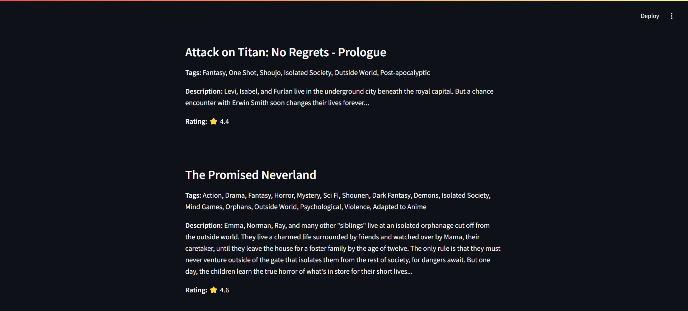
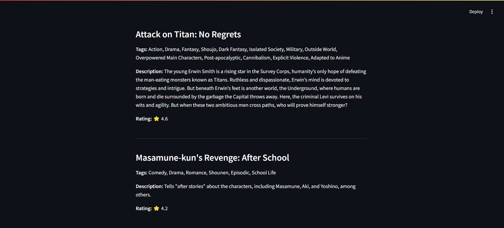

# Project: Manga Recommender System Using Machine Learning!


## Table of Contents

- [Project Overview](#project-overview)
- [Demo](#demo)
- [Dataset Used](#dataset)
- [Concept for Model.pkl file](#concept)
- [Installation & Setup](#installation--setup)

---

<h2 id="project-overview">Project Overview</h2>
Recommendation systems are increasingly important in today’s world, where people have limited time and an overwhelming number of choices. Our Manga Recommendation System helps users discover new manga, manhwa, and manhua based on their selections. By choosing a title from a provided list, the system analyzes its description and tags to suggest similar content, making it easier to find stories that match the user's interests.

---

<h2 id="demo">Demo</h2>





---

<h2 id="dataset">Dataset Used</h2>

* [Dataset link](https://www.kaggle.com/datasets/victorsoeiro/manga-manhwa-and-manhua-dataset)


---

<h2 id="concept">Concept for Model.pkl file</h2>

1. Cosine Similarity is a metric that allows you to measure the similarity of documents.

2. In order to demonstrate the cosine similarity function, we need vectors. Here, vectors are represented as NumPy arrays.

3. Once we have vectors, we can call cosine_similarity() by passing both vectors. It will calculate the cosine similarity between them.

4. The result will be a value between [0,1]. If it is 0, the vectors are completely different. If it is 1, they are completely similar.

---

<h2 id="installation--setup">Installation & Setup</h2>

### STEPS:

Clone the repository

```bash
https://github.com/Zakir09/Recommender_System.git
```
### STEP 01- Create a conda environment after opening the repository

```bash
conda create -n manga_env python=3.12.0 -y
```

```bash
conda activate manga_env
```


### STEP 02- install the requirements
```bash
pip install -r requirements.txt
```


```bash
#run this file to generate the models

recommender_system.ipynb
```

Now run,
```bash
streamlit run app.py
```
