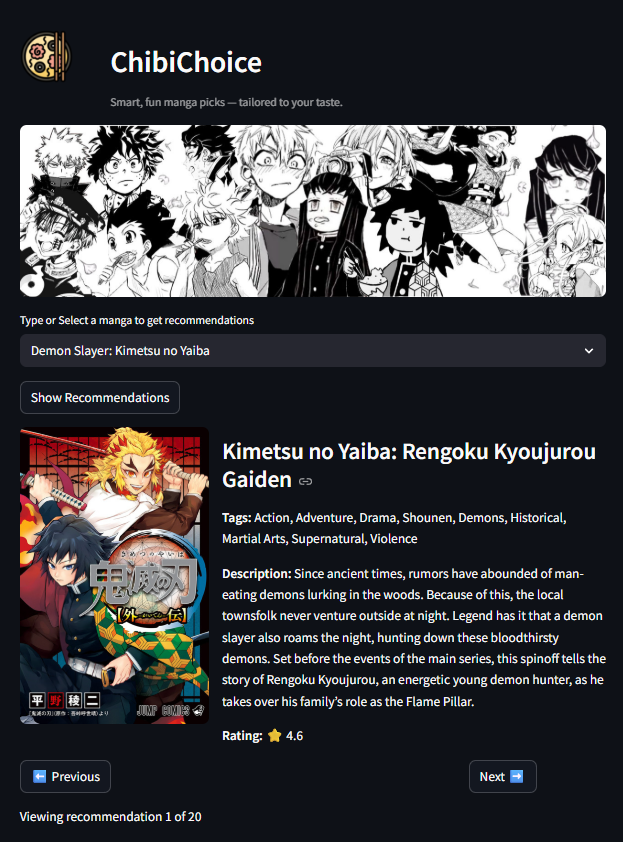
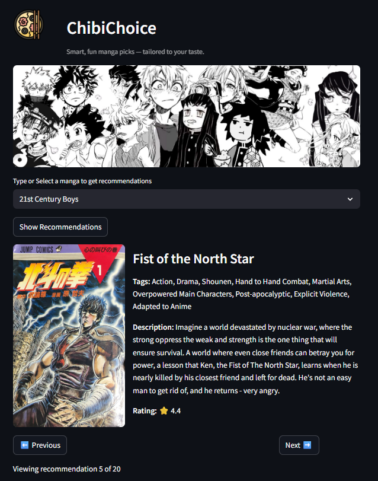
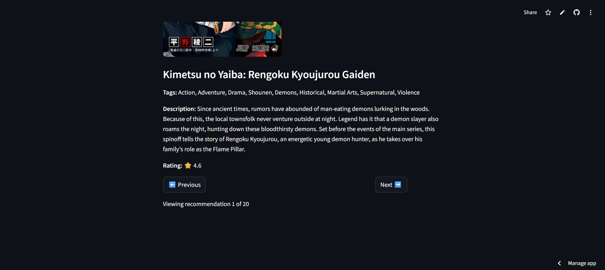
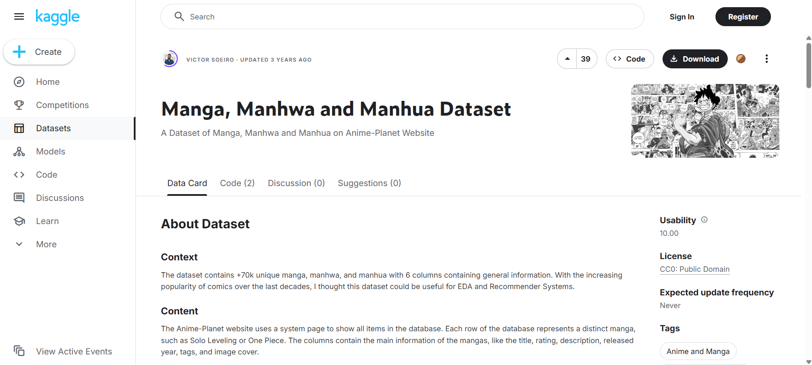

# Project: Manga Recommender System Using Machine Learning!


## Table of Contents

- [Project Overview](#project-overview)
- [Features](#features)
- [Live Demo](#live-demo)
- [Technologies Used](#technologies-used)
- [Dataset Used](#dataset-used)
- [Recommendation Logic](#recommendation-logic)
- [Installation & Setup](#installation--setup)

---

<h2 id="project-overview">Project Overview</h2>

As someone who loves manga, I frequently asked myself, "What should I read next?" Unfortunately, this meant I spent more time hunting for titles than actually reading. Finding manga recommendations isn't as straightforward as it is for mainstream media, especially if you're not part of online communities or lucky enough to stumble upon a gem. I was looking for something that felt more personal and insightful.

This project, **ChibiChoice**, came to life from a mix of frustration and a genuine interest in diving into machine learning in a way that puts users first. The aim was straightforward: to create a system that suggests manga, manhwa, or manhua titles based on the user's current favourites.

To help users find manga titles that share similar themes and narratives, the app dives into genre tags and descriptions, utilising natural language processing and similarity scoring. Built on Streamlit and featuring remote model storage through Hugging Face, the interface is designed to be user-friendly, engaging, and fully interactive.

Users have the option to select as many as 20 well-crafted recommendations by just picking a manga book from a list. These recommendations come with ratings, genre tags, cover art, and descriptions that are dynamically fetched from the Jikan API. The goal was to make the discovery process enjoyable and smart, much like receiving a recommendation from a friend who truly understands your preferences.

To tackle a practical problem that I was genuinely interested in, this project allowed me to blend a range of skills and tools, from data wrangling and model development to API integration and UI design.

---

<h2 id="features">Features</h2>

- **Personalised Manga Recommendations:**  
  By choosing a manga title from a wide-ranging list, users can receive up to 20 tailored suggestions for similar manga, manhwa, or manhua that suit their tastes.

- **Advanced Similarity Matching:**  
  The recommendations come from a smart machine learning model that measures cosine similarity between manga descriptions and tags. This way, it can provide you with suggestions that are both relevant and meaningful.

- **Dynamic Cover Art Fetching:**  
  All the recommended manga showcase their cover images, fetched live from the Jikan API, giving you a more engaging browsing experience.

- **Interactive Navigation:**  
  Users have the convenience of browsing through recommendations using the "Previous" and "Next" buttons, allowing them to cycle through the list with ease.

- **Clean and Responsive UI:**  
  This app, built using Streamlit, offers a clean and intuitive interface that makes it super easy to explore.

- **Remote Model & Data Loading:**  
  The app pulls in datasets and similarity matrices straight from remote sources like Hugging Face, which helps keep it lightweight and super easy to update.

- **Efficient Performance with Caching:**  
  The app takes advantage of Streamlit’s caching decorators (`@st.cache_resource` and `@st.cache_data`) to load large datasets and API responses efficiently, ensuring that they’re only loaded once per session. This approach greatly enhances loading times and creates a seamless experience for users.

- **Error Handling & Feedback:**  
  The app takes care of missing images or any network troubles by showing placeholder images and guiding users along the way.

---

<h2 id="live-demo">Live Demo</h2>

Try out the live application here:  
➡️ [ChibiChoice - Manga Recommender](https://chibichoice.streamlit.app/)

If you prefer to see some example recommendations or if the live demo is unavailable, here are some screenshots showcasing different recommendations the app provides:





---

<h2 id="technologies-used">Technologies Used</h2>

- `Python`
- `Pandas`
- `NumPy`
- `NLTK`
- `Scikit-learn`
- `Pickle + Gzip`
- `Streamlit`
- `Hugging Face`

---

<h2 id="dataset-used">Dataset Used</h2>

The dataset I was working with for this project is the **Manga, Manhwa, and Manhua Dataset** from Kaggle. It’s packed with detailed info on thousands of manga titles, covering everything from their names and descriptions to tags, ratings, and other important metadata.

This rich dataset provides the foundation for generating meaningful recommendations based on content similarity.

You can find the original dataset here:  
➡️ [Manga, Manhwa, and Manhua Dataset on Kaggle](https://www.kaggle.com/datasets/victorsoeiro/manga-manhwa-and-manhua-dataset)



### Data Cleaning and Transformation

To get the dataset ready for making solid recommendations, I went through a few preprocessing steps:

- **Filtered for quality:** To keep things relevant, I eliminated any entries with missing values and only kept manga that scored 4.0 or above. This ensures we're highlighting titles that are truly appreciated and well-liked.
- **Dropped unnecessary columns:** The cover image URLs have been taken out since they weren’t essential for content comparison.
- **Processed tags and descriptions:**  
  - I transformed the tags from stringified lists into neat, comma-separated strings that have a consistent format. 
  - I processed the description text by tokenizing and cleaning it, removing spaces and special characters to create a uniform set of terms.
  - The description and tags have been combined into one “fulltag” field that represents the main features of the content.
- **Normalised text:** I made sure to lowercase and stem the words in the “fulltag” field with Porter stemming. This approach helps minimise word variations and boosts matching accuracy.

These steps took the messy raw dataset and turned it into a neat, organised format that's perfect for creating a reliable and efficient recommendation engine.

---

<h2 id="recommendation-logic">Recommendation Logic</h2>

With the dataset all cleaned up and the features nicely engineered, the next step was to create a system that can highlight similar manga titles based on their content. Let me explain how the recommendation engine works:

### 🔍 Feature Vectorisation

I made use of scikit-learn's **CountVectorizer** to evaluate the textual content of each manga, which consists of tags and descriptions:

```python
from sklearn.feature_extraction.text import CountVectorizer

cv = CountVectorizer(max_features=11000, stop_words='english')
vector = cv.fit_transform(manga['fulltag']).toarray()
```

- What this does is convert the `fulltag` field of each manga into a vector that represents the count of words.
- What you get is a matrix that has the dimensions `(10960, 11000)`, where each row stands for a unique manga.

### 📐 Measuring Similarity

Once I vectorised the data, I used cosine similarity to measure how similar the vectors are. This metric looks at the angle between two vectors to determine their similarity:

```python
from sklearn.metrics.pairwise import cosine_similarity

similarity = cosine_similarity(vector)
```
- The similarity matrix I ended up with has a size of `(10960, 10960)`, where each cell `[i][j]` indicates how similar manga i is to manga j.
- A score of 1.0 indicates that the titles share the same features, while a score of 0.0 means they are entirely different.

### 🔧 Reducing Noise: Keep Top-N Recommendations

To make things more relevant and less cluttered, I decided to keep only the top 20 manga that are most similar for each title:

```python
def keep_top_n_per_row(similarity_matrix, n=20):
    # Logic to keep top N similar titles per manga, excluding self
    ...
similarity_reduced = keep_top_n_per_row(similarity, n=20)
```

- This step is all about sifting through the weaker recommendations, which in turn boosts the engine's speed and sharpens its focus.
- It also makes sure that we only show the most relevant results for each manga.

---

<h2 id="installation--setup">Installation & Setup</h2>

### STEPS:

Clone the repository

```bash
https://github.com/Zakir09/Recommender_System.git
```
### STEP 01- Create a conda environment after opening the repository

```bash
conda create -n manga_env python=3.12.0 -y
```

```bash
conda activate manga_env
```


### STEP 02- install the requirements
```bash
pip install -r requirements.txt
```


```bash
#run this file to generate the models

recommender_system.ipynb
```

Now run,
```bash
streamlit run app.py
```
